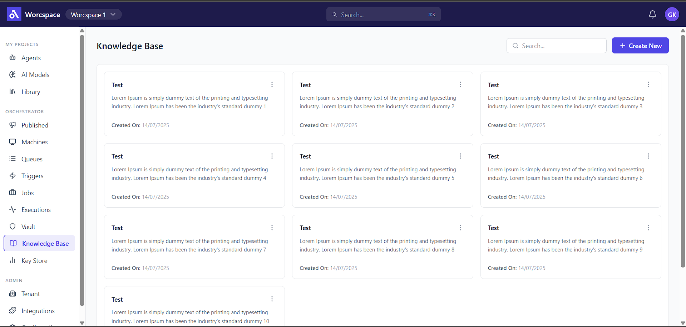
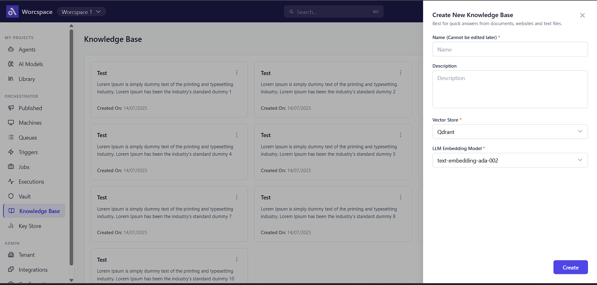

# Knowledge Base UI

A responsive front-end application built with **React** and **Tailwind CSS**, replicating a Figma design for a Knowledge Base management interface.

## Screenshots

### Screen 1 — Home Screen

The main Knowledge Base page displaying article cards in a 3-column grid with search, pagination, and a "Create New" button.

### Screen 2 — Create New Modal
A slide-in panel triggered by the "Create New" button, containing a form to create a new Knowledge Base entry.


---

## Tech Stack

- **React** (Vite + functional components + hooks)
- **Tailwind CSS v3**
- **Lucide React** (icons)

---

## Folder Structure

```
src/
├── assets/
├── components/
│   ├── knowledge-base/
│   │   ├── ArticleCard.jsx       # Individual card component
│   │   └── CreateNewForm.jsx     # Form inside the modal
│   ├── layout/
│   │   ├── Header.jsx            # Top navigation bar
│   │   └── Sidebar.jsx           # Left sidebar with navigation links
│   └── ui/
│       └── Modal.jsx             # Reusable modal/panel component
├── pages/
│   └── HomePage.jsx              # Main page with grid + pagination
├── App.jsx                       # Root component with modal state
├── main.jsx                      # Vite entry point
└── index.css                     # Tailwind directives
```

---

## Getting Started

### Prerequisites

- Node.js v18+
- npm

### Installation

```bash
# Clone the repository
git clone https://github.com/your-username/knowledge-base-ui.git

# Navigate into the project
cd knowledge-base-ui

# Install dependencies
npm install
```

### Run Development Server

```bash
npm run dev
```

Open [http://localhost:5173](http://localhost:5173) in your browser.

### Build for Production

```bash
npm run build
```

---

## Features

- **Pixel-accurate UI** replicating the provided Figma design
- **3-column card grid** displaying Knowledge Base entries
- **Pagination** — configurable rows per page (10, 25, 50), with first/prev/next/last navigation
- **Create New modal** — slide-in panel with form fields:
  - Name (required, cannot be edited later)
  - Description
  - Vector Store (dropdown)
  - LLM Embedding Model (dropdown)
- **Keyboard support** — press `Escape` to close the modal
- **Active sidebar highlighting** for the current page
- **Responsive layout** with fixed header and scrollable sidebar

---

## Color Palette

| Role      | Hex       |
|-----------|-----------|
| Primary   | `#4F46E5` |
| Secondary | `#1E1B4B` |

---

## Component Overview

| Component | Description |
|---|---|
| `Header` | Top bar with logo, workspace selector, search, notifications, and avatar |
| `Sidebar` | Left nav with MY PROJECTS, ORCHESTRATOR, and ADMIN sections |
| `ArticleCard` | Card showing title, description, created date, and a 3-dot menu |
| `CreateNewForm` | Form with inputs for creating a new Knowledge Base |
| `Modal` | Reusable right-side panel with backdrop and Escape key support |
| `HomePage` | Composes all components, manages modal state and pagination |